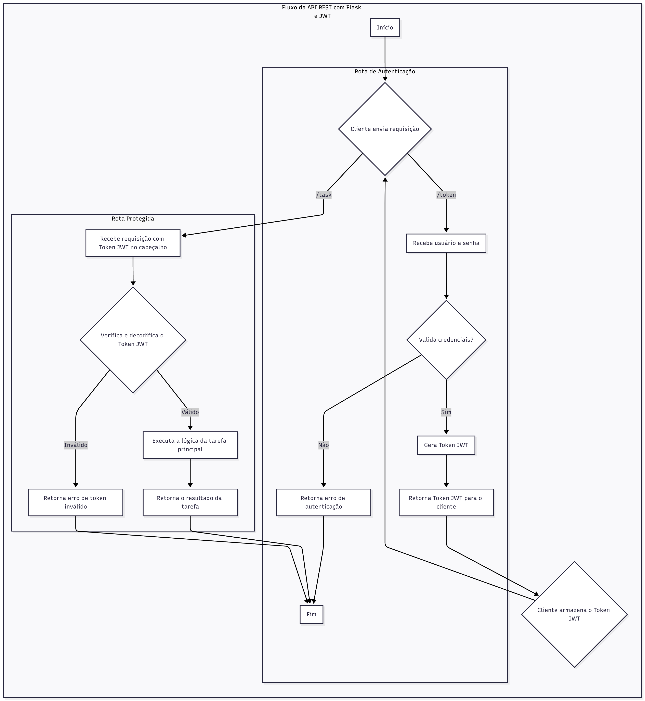

# 🏥 Hackathon - API de Processamento de Pacientes

API REST desenvolvida em **Python (Flask)** para análise e filtragem de solicitações de pacientes conforme o script `pacientesE2.py`.  
Inclui autenticação **JWT**, geração automática de CSV e opção de **filtrar solicitações pendentes** via query string ou JSON.



## 🧩 Pré-requisitos

Instale as dependências necessárias:

```bash
pip install Flask PyJWT polars
```

> **Observação:** A biblioteca `polars` é utilizada para o processamento dos arquivos CSV.

---

## 🚀 Execução

Execute o servidor Flask na raiz do projeto:

```bash
python api_class.py
```

O servidor será iniciado em:  
**http://127.0.0.1:5000**

---

## 📂 Estrutura Esperada

A API espera encontrar os arquivos de entrada:

```
datasets/
 ├── solicitacao.csv
 └── procedimento.csv
```

E gera automaticamente a saída:

```
dado_minerado/
 └── pessoas_pacientes.csv
```

---

## ♥️ Verifica Status

### **POST /healthz**

- **Resposta (200 OK):**
  ```json
  {
      "status": "ok"
  }
  ```

## 🔐 Autenticação

Gera um token de acesso **JWT** válido por **1 hora**.

### **POST /token**

- **Corpo (JSON):**
  ```json
  {
      "login": "user_hackathon",
      "senha": "senha123"
  }
  ```
- **Resposta (200 OK):**
  ```json
  {
      "token": "seu.jwt.token.aqui"
  }
  ```

---

## ⚙️ Endpoint Principal

### **/task**

Executa o processamento dos pacientes com base nas solicitações e procedimentos disponíveis, retornando apenas as solicitações que correspondem ao **status** informado.

#### **Métodos Suportados:**
- `GET`
- `POST`

#### **Autenticação:**
Requer o header:
```
Authorization: Bearer <seu_token_jwt>
```

#### **Formas de Filtrar o Status:**

Você pode especificar o status desejado de **duas formas**:

##### 🔹 1. Via Query String

```bash
GET /task?status=SOLICITAÇÃO%20/%20PENDENTE%20/%20REGULADOR
```

##### 🔹 2. Via Corpo JSON

```json
{
    "status": "SOLICITAÇÃO / PENDENTE / REGULADOR"
}
```

##### 🔹 3. Sem Filtro (padrão)

Se nenhum status for informado, será usado:
```
"SOLICITAÇÃO / PENDENTE / REGULADOR"
```

---

### 🧾 Exemplo de Resposta

```json
{
    "status": "sucesso",
    "filtro_status": "SOLICITAÇÃO / PENDENTE / REGULADOR",
    "quantidade": 128,
    "resultado": [
        {
            "solicitacao_id": 1234,
            "data_solicitacao": "2024-10-03 09:30:00",
            "solicitacao_status": "SOLICITAÇÃO / PENDENTE / REGULADOR",
            "solicitacao_risco": "amarelo",
            "tempo_teorico_max_espera_dias": 90,
            "dias_desde_solicitacao": 45,
            "procedimento": "Eletrocardiograma",
            "procedimento_especialidade": "Cardiologia"
        }
    ],
    "saida_csv": "dado_minerado/pessoas_pacientes.csv"
}
```

---

## 🧪 Exemplo de Uso (via cURL)

### 1. Obter Token

```bash
curl -X POST http://127.0.0.1:5000/token      -H "Content-Type: application/json"      -d '{"login": "user_hackathon", "senha": "senha123"}'
```

### 2. Executar a Tarefa (via query string)

```bash
curl -X GET "http://127.0.0.1:5000/task?status=SOLICITAÇÃO%20/%20PENDENTE%20/%20REGULADOR"      -H "Authorization: Bearer seu.jwt.token.aqui"
```

### 3. Executar a Tarefa (via JSON)

```bash
curl -X POST http://127.0.0.1:5000/task      -H "Content-Type: application/json"      -H "Authorization: Bearer seu.jwt.token.aqui"      -d '{"status": "SOLICITAÇÃO / PENDENTE / REGULADOR"}'
```

---

## 📊 Saída Gerada

- **Arquivo CSV:** `dado_minerado/pessoas_pacientes.csv`
- **Campos principais:**
  - `solicitacao_id`
  - `data_solicitacao`
  - `solicitacao_status`
  - `solicitacao_risco`
  - `procedimento_sisreg_id`
  - `tempo_teorico_max_espera_dias`
  - `dias_desde_solicitacao`
  - `procedimento`
  - `procedimento_especialidade`

---

## 🧠 Lógica de Negócio (Resumo)

O endpoint `/task` realiza as seguintes operações:

1. Lê os arquivos `solicitacao.csv` e `procedimento.csv`.  
2. Filtra os registros conforme o **status** informado.  
3. Encontra e associa o procedimento correspondente.  
4. Calcula:
   - **Tempo teórico máximo de espera** com base no risco.  
   - **Dias desde a solicitação** com base na data atual.  
5. Exporta o resultado em CSV e retorna também via JSON.

---

## 🧾 Licença

Este projeto é de uso interno da Hackathon e destina-se a fins educacionais e de demonstração.
